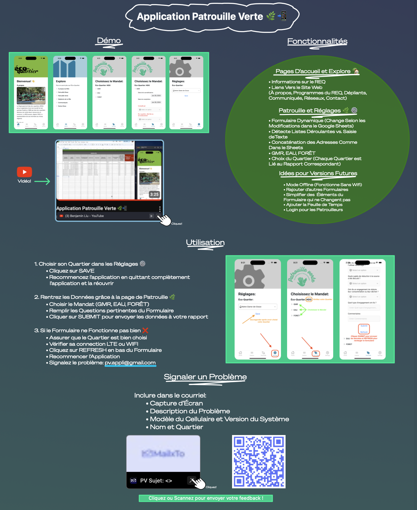
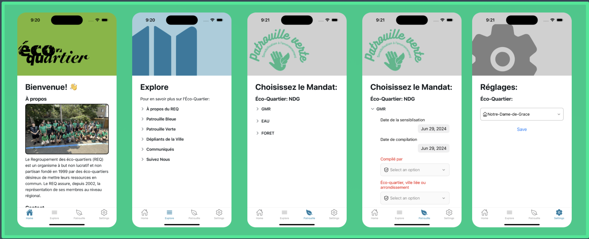
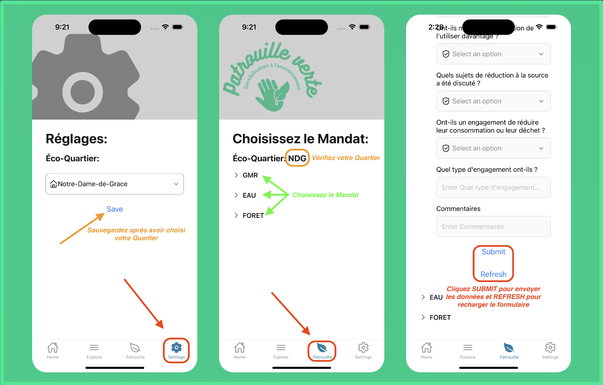

# 🌿 Patrouille Verte — Mobile Application

> Cross‑platform mobile app built for **Regroupement des Éco‑Quartiers (REQ), Montréal** to modernize data collection for the Patrouille Verte environmental program.

This project was **fully designed, developed, and delivered** by me (idea → UX → frontend → backend → deployment → user onboarding), and used by field agents.

## 📰 Recognition
- Featured in the official REQ Annual Report (2024): [View the report](https://www.eco-quartiers.org/_files/ugd/87ef24_1e81a2239f684f97a84a6cc10f1d78f7.pdf#page=12)

---

## 📱 Overview

Patrouille Verte is a mobile application that helps environmental agents collect structured data in the field and automatically sync it to Google Sheets for reporting. The app replaces manual processes, improves data consistency, and simplifies daily workflows for patrol teams.

The application also includes an informational section for users to learn more about the REQ and its initiatives.

---


## ✨ Features

### Home & Explore

* Information about the REQ
* Links to official resources (About, Programs, Flyers, Communications, Socials, Contact)

### Patrouille (Data Collection)

* Dynamic forms (fields update automatically based on Google Sheets configuration)
* Mandate selection: **GMR / Eau / Forêt**
* Smart dropdown detection vs free‑text entry
* Address concatenation logic (e.g., GMR, EAU, FORÊT formats)
* District (Éco‑quartier) selection linked to correct report sheet
* Automatic submission to centralized reporting spreadsheets

### Settings

* Select Éco‑Quartier (saved locally)
* Simple configuration for non‑technical users

### Planned / Future Improvements

* Offline mode (no connection required during patrols)
* Additional forms
* Simplified static fields
* Time sheet integration
* Authenticated login for agents

---

## 🧑‍💻 Tech Stack

* **Frontend:** React Native
* **Backend / Integration:** NodeJS, Google Sheets API
* **Cloud & Services:** Azure
* **Deployment:** CI/CD via GitHub Actions → Azure Web App
* **Platform:** iOS & Android

---

## 🎥 Demo

An easel board of the mobile app is available here:

> *[Easel Board](https://arc.net/e/8BFDFD2D-8EF2-4BDE-9C20-C4FDA95529EE)*

> 

---

## 📸 Screenshots

<p align="center">
  
  
</p>

---

## 🚀 Installation (Developer Setup)

```bash
# Install dependencies
npm install

# Run the app
npm start
```

> Requires React Native environment configured (Android Studio / Xcode).

---

## 📦 Deployment

Deployment is handled automatically via **GitHub Actions** to Azure Web App on each push to `master`.

CI/CD includes:

* Build
* Test
* Artifact packaging
* Secure Azure deployment using OIDC login

---

## 📈 Impact

* Replaced manual and inconsistent data collection
* Reduced reporting errors
* Improved adoption by non‑technical field agents
* Used in real municipal environmental operations

---

## 🤝 Acknowledgements

Built for:
**Regroupement des Éco‑Quartiers (REQ), Montréal**
Municipal environmental organization funded by the City of Montréal.

> This project represents a real-world, end‑to‑end software delivery: product thinking, stakeholder communication, technical architecture, implementation, and deployment.
